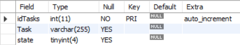

# Todo App

A simple Todo app made with pure Php OOP and Sass and bootstrap.

## Table structure

```
Database name : whatever you want
Table name : Tasks
```



## Project setup

```
You can run the page on any server( i guess ).
 This is what i used in my setup :
 Apache 2.4.25 - PHP 7.3.15
 Mysql as database
```

### Notice

```
License included
Credit is appreciated but not necessary.
you can reach me @ZTF666@protonmail.ch
```
